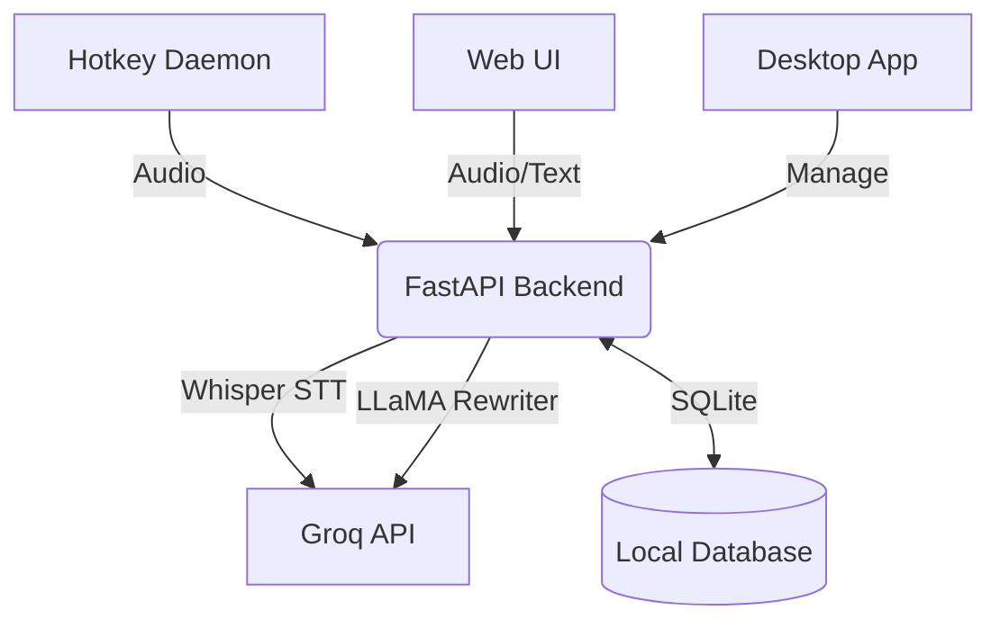

# Lynx — AI Voice Dictation Assistant

Lynx is a high-performance, privacy-first voice dictation system that transforms raw speech into polished, context-aware text. Leveraging Groq's lightning-fast Whisper STT and LLaMA models, it provides near-instant transcription and intelligent rewriting tailored to your unique writing style.

**Hold your hotkey, speak naturally, and watch as perfectly formatted text appears at your cursor.**


---

## 🚀 Features

-   **Global Push-to-Talk** — Default `Ctrl+Space`. Records while held, transcribes and auto-pastes upon release.
-   **Intelligent AI Polishing** — Automatically cleans up "ums," "ahs," and stuttering. Tailors output to specific contexts (Email, Slack, Notes, Documentation).
-   **Personalized User Profile** — Define your name, role, preferred tone, and a **Custom Dictionary** for specialized jargon or names.
-   **Seamless Desktop Integration** — Works across all Linux applications (Wayland and X11 support) by injecting text directly into the focused window.
-   **Voice Activity Detection (VAD)** — Intelligently detects silence to automatically stop recording if you forget to release the key.
-   **Real-time Visual Feedback** — Animated overlay and system tray indicators show recording levels and processing states.
-   **Web Dashboard** — Full-featured browser interface for manual recording, history management, and profile configuration.
-   **Desktop Management App** — A dedicated Tkinter GUI to manage backend services, view logs, and monitor system health.

---

## 🏗️ Architecture



| Component | Path | Purpose |
| :--- | :--- | :--- |
| **Backend API** | `app/` | FastAPI server handling STT, rewriting, and data persistence. |
| **Web UI** | `web/` | Modern browser dashboard for centralized management. |
| **Hotkey Daemon** | `scripts/lynx_daemon/` | Core background process for global PTT and system integration. |
| **Desktop App** | `desktop/` | GUI for orchestrating services and viewing logs. |
| **Utilities** | `scripts/` | Installation, bootstrap, and service management scripts. |

---

## 🛠️ Setup & Installation

### 1. Prerequisites

-   **Python 3.10+**
-   **Groq API Key** — [Get yours here](https://console.groq.com/)
-   **Linux Distribution** — Optimized for Ubuntu 22.04+ (Wayland/X11).

#### System Dependencies:
```bash
# Ubuntu/Debian
sudo apt update && sudo apt install -y alsa-utils wl-clipboard wtype libnotify-bin sqlite3
```
*Note: For X11 users, `xclip` and `xdotool` are used automatically if detected.*

### 2. Quick Installation

```bash
# Clone the repository
git clone https://github.com/devsidd/willow-groq-clone.git
cd willow-groq-clone

# Run the bootstrap script
./scripts/bootstrap.sh

# Configure environment
cp .env.example .env
```

### 3. Configuration

**Crucial Step:** Open `.env` and add your `GROQ_API_KEY`.

```env
GROQ_API_KEY=gsk_your_key_here
PORT=18080
WILLOW_CLONE_URL=http://127.0.0.1:18080
```

---

## 🏁 Usage

### Starting the Services

The easiest way to start Lynx is using the unified start script:
```bash
./scripts/start_all.sh
```
This launches the **Backend API** (port 18080) and the **Hotkey Daemon** in the background.

### Using the Hotkey
1.  Focus any text field (Browser, VS Code, Slack, etc.).
2.  **Hold `Ctrl + Space`**.
3.  Speak your mind.
4.  **Release**.
5.  Wait a moment for the notification; the polished text will be typed out automatically.

### Web Dashboard
Visit [http://127.0.0.1:18080](http://127.0.0.1:18080) to:
-   Configure your **User Profile** (Tone, Role, Dictionary).
-   View your **Transcription History**.
-   Test different rewriting styles manually.

### Desktop App
Launch the management GUI:
```bash
./scripts/run_desktop_app.sh
```

---

## 🧹 Maintenance & Troubleshooting

### Resetting the Database
If you need to wipe your history or profile:
```bash
pkill -f uvicorn
rm data/lynx.db
./scripts/start_all.sh
```

### Logs
Monitor system behavior:
-   **Backend Logs**: `tail -f backend.log`
-   **Hotkey Logs**: `tail -f hotkey.log`

### Common Issues
-   **API Error (500)**: Ensure your `GROQ_API_KEY` is correct in `.env`.
-   **No Audio**: Verify your microphone is recognized by `arecord -l`.
-   **Hotkey Not Working on Wayland**:
    -   Option 1 (Recommended): Go to **Settings > Keyboard > View and Customize Shortcuts > Custom Shortcuts**. Add a new one named `Lynx Toggle` with the command `/full/path/to/Lynx/scripts/lynx_toggle.sh` and bind it to your preferred key.
    -   Option 2: Add your user to the `input` group: `sudo usermod -aG input $USER` (requires logout/login). This allows the daemon to read keys directly.
-   **System Tray Missing on GNOME**: Install the AppIndicator support: `sudo apt install gir1.2-ayatanaappindicator3-0.1`.

## Configuration

All settings are in `.env` (copy from `.env.example`):

| Variable | Default | Description |
|----------|---------|-------------|
| `GROQ_API_KEY` | — | Your Groq API key (required) |
| `GROQ_STT_MODEL` | `whisper-large-v3-turbo` | Speech-to-text model |
| `GROQ_TEXT_MODEL` | `llama-3.3-70b-versatile` | LLM for rewriting |
| `PORT` | `8080` | API server port |
| `WILLOW_HOTKEY` | `ctrl+space` | Global hotkey binding |
| `WILLOW_STYLE` | `professional` | Default writing style |
| `WILLOW_CONTEXT` | `email` | Default context (email/slack/notes/docs) |
| `WILLOW_LANGUAGE` | `en` | Transcription language |
| `WILLOW_AUTO_PASTE` | `true` | Auto-type text into active window |
| `WILLOW_INSERT_MODE` | `type` | How to insert text (`type` or `paste`) |
| `WILLOW_OVERLAY` | `true` | Show recording overlay |
| `WILLOW_VAD_ENABLED` | `true` | Auto-stop on silence |
| `WILLOW_VAD_SILENCE_TIMEOUT` | `3` | Seconds of silence before auto-stop |

## API Endpoints

| Method | Path | Description |
|--------|------|-------------|
| `GET` | `/api/health` | Health check |
| `GET` | `/api/profile` | Get user profile |
| `PUT` | `/api/profile` | Update profile |
| `POST` | `/api/transcribe` | Upload audio, get transcription + rewrite |
| `POST` | `/api/rewrite` | Rewrite plain text |
| `GET` | `/api/history` | List transcription history |
| `GET` | `/api/settings` | Get app settings |
| `PUT` | `/api/settings` | Update a setting |
| `GET` | `/api/export` | Export all data as JSON |

## How Session Memory Works

Lynx feeds the last 5 dictations (from the same context, within 30 minutes) to the LLM as context. This means:

- Pronouns like "he" or "that project" resolve correctly across dictations
- Tone stays consistent when dictating a long email in parts
- Greetings and sign-offs aren't repeated
- Different contexts (email vs Slack) have separate memory

## Privacy

- All data is stored locally in SQLite (`data/lynx.db`)
- Audio and text are sent to Groq APIs using **your** API key
- No telemetry, no third-party tracking
- Configure data retention on your Groq account if needed

## Troubleshooting

| Problem | Fix |
|---------|-----|
| `Rewrite failed` / `Transcription failed` | Check `GROQ_API_KEY` and model names in `.env` |
| Browser mic denied | Allow microphone permissions for localhost |
| No clipboard integration | Install `wl-copy`/`wtype` (Wayland) or `xclip`/`xdotool` (X11) |
| Hotkey not working | Install `requirements-hotkey.txt` in `.venv` |
| Old clipboard text pasted | Ensure `WILLOW_INSERT_MODE=type` in `.env` |

## License

MIT
